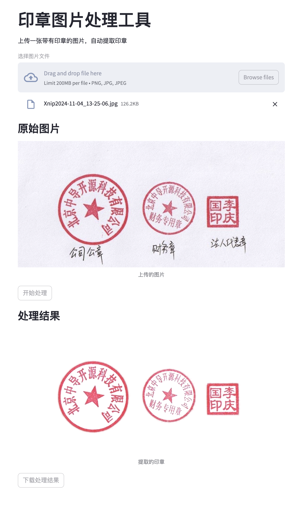

# SealCut
公章（印章）抠图工具，快速提取透明背景印章。

# 用法
下载代码，安装必要的依赖，直接运行即可。代码比较简单，只能处理红色的印章，尽可能使用扫描文件，会有最佳效果。
```shell
streamlit run app.py
```

## 在线使用
同时，我也上传了一个 streamlit 云端的版本，可以直接使用。

[https://sealcut.streamlit.app/](https://sealcut.streamlit.app/)

如果你需要盖骑缝章，可以试试 [小印章](https://esign.freecicoda.com/)

# 截图示例
